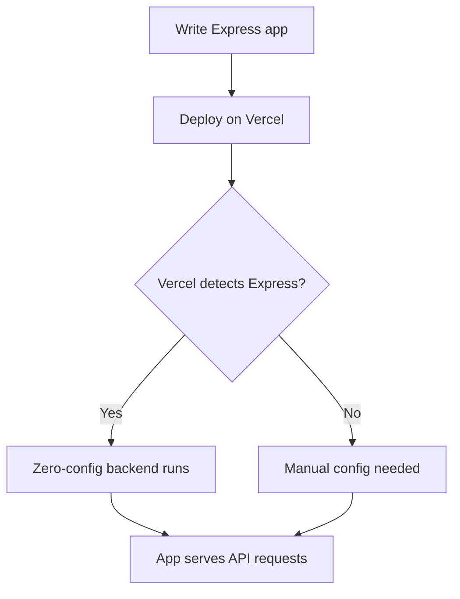

# What changed: Zero-configuration Express backends

Vercel now supports zero-configuration Express backends. This means you can deploy Express apps alongside your Next.js projects without extra setup. It’s faster to start, easier to maintain, and fits well with modern React/Next.js workflows.

## Why it matters for React/Next.js teams

- **Performance and DX:** Express servers run without manual config. Less setup means fewer errors and faster iteration.
- **Stack fit:** Works smoothly with Next.js API routes and server components.
- **Who should care:** Frontend engineers, developer experience leads, and performance champions.

## Background

Previously, deploying an Express backend required manual configuration. You had to set up custom servers or adjust build settings. This added complexity and risked deployment issues.

Now, Vercel detects Express apps automatically. It handles the server setup behind the scenes. This removes boilerplate and lets you focus on code.

### Breaking changes or migrations

- If you used custom Express server setups, you should test deployments carefully.
- Old manual configs may conflict with the new zero-config system.
- Migrating mostly means removing custom server code and relying on the new defaults.

## Steps to get started

### 1. Minimal Express app example

```js
const express = require('express');
const app = express();

app.get('/api/hello', (req, res) => {
  res.json({ message: 'Hello from Express!' });
});

module.exports = app;
```

### 2. Enable zero-config (usually automatic)

On Vercel, no extra flags are needed if you have an `express` dependency and export the app. Just deploy.

If you want to disable it, you can set `vercel.json` with:

```json
{
  "functions": {
    "api/**/*.js": {
      "runtime": "nodejs"
    }
  }
}
```

### 3. Use Express APIs end-to-end

Your Express routes work as usual. You can combine them with Next.js API routes or server components.

Example request:

```bash
curl https://your-project.vercel.app/api/hello
```

Response:

```json
{ "message": "Hello from Express!" }
```

## Pitfalls to watch

- **Misconfiguration:** Mixing custom Express servers with Next.js can cause conflicts.
- **Edge cases:** SSR and Edge runtimes don’t support Express. Use Next.js API routes or Edge functions there.
- **Performance:** Express adds some overhead compared to native Next.js API routes. Test your app’s needs.

## Checklist before shipping

- Measure Web Vitals before and after deploying Express backend.
- Ship a small demo page that calls your Express API.
- Add monitoring and alerts for your Express endpoints.
- Plan a rollback in case of deployment issues.
- Share your learnings with your team.



## Summary

Zero-configuration Express backends simplify backend deployment for React and Next.js teams. They reduce setup time and improve developer experience. But watch out for SSR and Edge limits. Test performance and monitor your endpoints.

# Further reading

- [Zero-configuration Express backends - Vercel](https://vercel.com/changelog/zero-configuration-express-backends)
- [Blog - Vercel](https://vercel.com/blog)
- [Changelog - Vercel](https://vercel.com/changelog)
