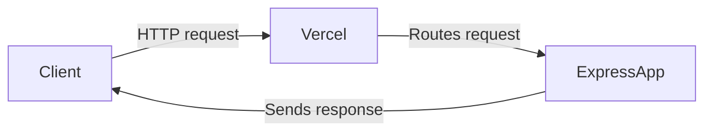

# Zero-configuration Express backends

## What changed: Zero-configuration Express backends

Vercel now supports Express backends without any setup. That means you can add Express APIs to your Next.js app quickly. No configs, no fuss. This is good news for React and Next.js teams who want flexible backends fast.

## Why it matters

Express is a popular Node.js framework for backends. But setting it up often meant extra config and build steps. This change removes that friction.

- **Performance:** Express routes run optimized on Vercel's platform.
- **Developer Experience:** No config means less boilerplate and faster iteration.
- **Deployment:** Deploy your full stack app with one command.

In a typical Next.js stack, you might use API routes or serverless functions. Express adds a familiar, powerful backend option. Frontend devs, DX owners, and performance leads should explore this.

## Background

Before, to use Express with Next.js on Vercel, you needed custom server setups or extra config. This was complex and error-prone.

Now, Vercel auto-detects Express apps in your project. It handles routing and deployment automatically.

There are no breaking changes to existing API routes. Express support is additive. If you had custom servers, consider migrating to this new setup for simplicity.

## Steps to get started

Here is a minimal Express backend inside a Next.js project:

```js
// /api/express.js
const express = require('express');
const app = express();

app.get('/hello', (req, res) => {
  res.json({ message: 'Hello from Express!' });
});

module.exports = app;
```

No special flags or config needed. Just deploy to Vercel.

### Key API usage example

You can add multiple routes:

```js
app.post('/data', (req, res) => {
  // handle POST data
  res.status(201).json({ status: 'saved' });
});
```

Vercel runs this Express app as your backend. It handles the HTTP lifecycle.

## Pitfalls

- **Misconfigurations:** Make sure your Express app is exported correctly. Use `module.exports = app;`.
- **Edge cases:** Express runs on Node.js server, not on Edge runtime. Don't use Edge-only APIs inside Express handlers.
- **Performance:** Avoid heavy synchronous code in Express routes. It can block the event loop.

## Checklist before shipping

1. Measure Web Vitals before and after adding Express routes.
2. Ship a small demo page that calls your Express backend.
3. Add logging and monitoring to catch errors.
4. Have a rollback plan if issues arise.
5. Share your findings with your team.



## Further reading

- [Zero-configuration Express backends - Vercel](https://vercel.com/changelog/zero-configuration-express-backends)
- [Blog - Vercel](https://vercel.com/blog)
- [Changelog - Vercel](https://vercel.com/changelog)

