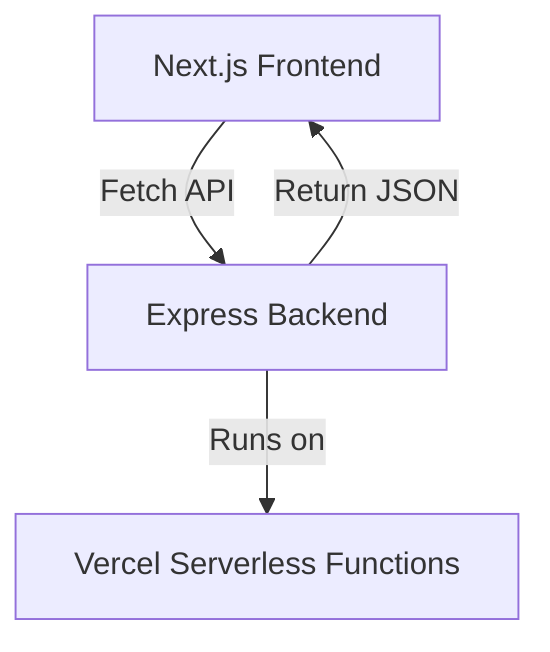

# Zero-configuration Express backends

## What changed

Vercel now supports zero-configuration Express backends. This means you can add Express APIs to your Next.js apps without extra setup. No manual server configs or builds needed.

This update simplifies backend deployment. It fits modern React/Next.js teams who want fast APIs alongside their frontend. Let's see why this matters.

---

## Why it matters

### Impact on performance, DX, and deployment

Express is a popular Node.js web framework. Before, using Express with Next.js required custom server setups. That added complexity and slower deploys.

Now, zero-config Express backends run out of the box on Vercel. This reduces build times and deployment steps. It also improves developer experience (DX) by letting frontend teams write backend code without server headaches.

Performance stays solid. Vercel optimizes these Express routes automatically. You get fast cold starts and efficient routing.

### Where this fits in Next.js/React stacks

Many React apps use Next.js for SSR and static pages. But they also need backend APIs for data or auth.

Previously, teams used API routes or external services. Express gave more flexibility but was complex to deploy.

Zero-config Express lets you keep all code in one repo. Frontend and backend live together, making maintenance easier.

### Who should act

- Frontend developers who want to add backend logic quickly.
- Developer experience (DX) leads aiming to reduce friction.
- Performance champions looking to optimize full-stack apps.

If you maintain Next.js apps with APIs, this is worth trying.

---

## Background

### What is new

Vercel now automatically detects and runs Express apps inside your Next.js project. No extra config files or server scripts needed.

You write Express handlers as usual. Vercel handles routing and deployment seamlessly.

### Comparison to previous approach

Before, deploying Express required:

- Custom server entry points.
- Manual routing setup.
- Separate build steps.

Now, just add Express code under the `api` folder or any supported path. Vercel treats it as a backend function.

### Breaking changes or migrations

If you had a custom Express server, you might need to adapt your code structure.

Move Express routes into the `api` directory or a recognized backend folder.

Avoid custom server startup scripts. Let Vercel handle execution.

Check your environment variable usage and middleware compatibility. Most Express middleware works fine.

---

## Steps to get started

### Minimal repro snippet

Create a file `api/hello.js` with:

```js
const express = require('express');
const app = express();

app.get('/', (req, res) => {
  res.json({ message: 'Hello from Express!' });
});

module.exports = app;
```

This simple Express app will run as a backend API.

### Enable or set config

No extra flags needed. Just deploy to Vercel.

If you want to customize, you can add settings in `vercel.json`, but defaults work well.

### Key API usage example

Here is an end-to-end example with Next.js frontend calling Express backend:

`api/user.js`:

```js
const express = require('express');
const app = express();

app.get('/', (req, res) => {
  res.json({ user: { id: 1, name: 'Alice' } });
});

module.exports = app;
```

`pages/index.js`:

```jsx
import { useEffect, useState } from 'react';

export default function Home() {
  const [user, setUser] = useState(null);

  useEffect(() => {
    fetch('/api/user')
      .then(res => res.json())
      .then(data => setUser(data.user));
  }, []);

  if (!user) return <p>Loading...</p>;

  return <div>Hello, {user.name}</div>;
}
```

Deploy this to Vercel. The Express backend serves `/api/user`. The frontend fetches and displays the data.

---

## Pitfalls to watch

### Common misconfigurations

- Forgetting to export the Express app instance.
- Placing Express routes outside supported directories.
- Using unsupported Node.js APIs or native modules.

### Edge cases

- Server-side rendering (SSR): Express backends run separately from SSR code. Avoid mixing them.
- Edge functions: Express is Node.js based and does not run on Vercel Edge Runtime.
- Static exports: Express routes require serverless functions, so static export mode won't include them.

### Performance regressions

Cold starts can happen if your Express backend is large or has heavy dependencies.

Keep routes lean and avoid blocking code.

Use monitoring to spot slow endpoints.

---

## Checklist before shipping

1. **Measure before/after**
   - Use Web Vitals and backend metrics to compare performance.
2. **Ship a tiny demo page**
   - Deploy a minimal Express API and call it from a frontend page.
3. **Add monitoring/alerting**
   - Track errors and latency on Express routes.
4. **Plan rollback path**
   - Keep previous deployment or API routes ready to revert.
5. **Share learnings internally**
   - Document your setup and findings for the team.

---

## Diagram idea



---

## Further reading

- [Zero-configuration Express backends - Vercel](https://vercel.com/changelog/zero-configuration-express-backends)
- [Blog - Vercel](https://vercel.com/blog)
- [Changelog - Vercel](https://vercel.com/changelog)
