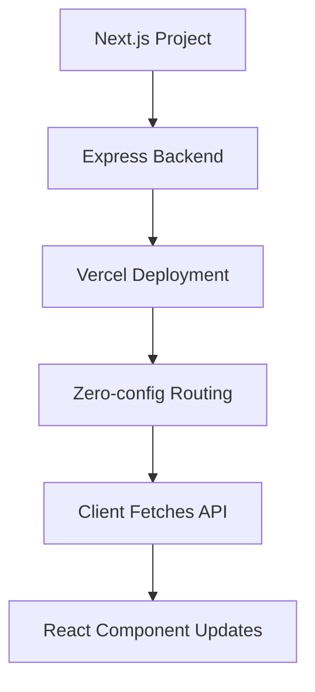

# Zero-configuration Express backends

## What changed

Vercel now supports zero-configuration Express backends. This means you can run Express apps alongside your Next.js projects without extra setup. It’s faster to deploy and simpler to maintain.

## Why it matters

Express is a popular Node.js backend framework. Many React and Next.js teams use it for APIs or server logic. But setting up Express with Next.js often needs manual config and custom servers.

Zero-config Express backends remove that friction. You get:

- Better developer experience (DX): no more boilerplate or hacks.
- Improved performance: optimized routing and deployment.
- Easier scaling: native support on Vercel’s platform.

For frontend devs, this means faster iteration. DX owners can reduce maintenance overhead. Performance champions get cleaner server code with less risk.

## Background

Before, integrating Express required custom servers or API routes with extra config. This added complexity and deployment challenges.

Now, Vercel automatically detects Express apps in your project. It configures routing and deployment for you. No changes to your codebase are needed.

This is not a breaking change. Existing setups still work. But you can migrate gradually to zero-config for simpler builds.

## Steps to get started

### 1. Minimal example

Create a simple Express app inside your Next.js project:

```js
// api/hello-express.js
const express = require('express');
const app = express();

app.get('/api/hello-express', (req, res) => {
  res.json({ message: 'Hello from Express!' });
});

module.exports = app;
```

### 2. Enable zero-config

No flags or config needed. Just deploy to Vercel. It will detect the Express app and handle it automatically.

### 3. Use it end-to-end

Call the Express endpoint from your React component:

```jsx
import { useEffect, useState } from 'react';

export default function Hello() {
  const [msg, setMsg] = useState('Loading...');

  useEffect(() => {
    fetch('/api/hello-express')
      .then(res => res.json())
      .then(data => setMsg(data.message))
      .catch(() => setMsg('Error fetching message'));
  }, []);

  return <div>{msg}</div>;
}
```

## Pitfalls to watch

- **Misconfigurations:** Avoid mixing Express apps with Next.js API routes that share the same paths. This can cause conflicts.
- **Edge and SSR:** Express runs on Node.js servers, so it won’t run on Edge runtimes or static exports. Plan accordingly.
- **Performance:** While zero-config optimizes routing, heavy Express middleware may still slow down responses. Profile your backend.

## Checklist before shipping

- Measure Web Vitals before and after adding Express endpoints.
- Ship a small demo page that calls your Express backend.
- Add monitoring and alerting for backend errors.
- Plan a rollback path if issues arise.
- Share learnings with your team to improve DX.



## Summary

Zero-configuration Express backends simplify running Node.js servers with Next.js. They improve DX and performance by removing manual setup. Use them to build richer APIs without extra complexity.

---

## Further reading

- [Zero-configuration Express backends - Vercel](https://vercel.com/changelog/zero-configuration-express-backends)
- [Blog - Vercel](https://vercel.com/blog)
- [Changelog - Vercel](https://vercel.com/changelog)
