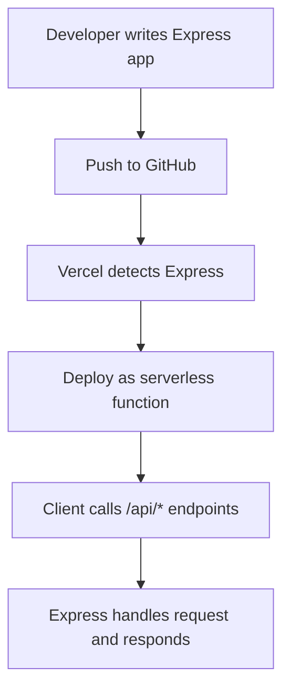

# What changed: Zero-configuration Express backends

Vercel now supports Express backends without any setup. This means you can deploy Express APIs alongside your Next.js app with zero config. No build tweaks, no extra server setup. Just push your code and it works.

## Why it matters

Express is a popular Node.js framework. Many React and Next.js teams use it for APIs. But setting up Express servers often needs config, custom servers, or separate deployments.

Zero-config Express backends change that. They:

- Improve developer experience by removing setup steps.
- Speed up deployment since no custom server is needed.
- Fit naturally inside Next.js projects, coexisting with pages and API routes.

This is great for frontend developers who want quick backend APIs without learning server internals. DX owners and performance champions also benefit because it reduces complexity and potential errors.

## Background

Previously, to use Express with Next.js, you had to create a custom server or deploy Express separately. This added overhead and could cause issues with scaling or routing.

Now, Vercel automatically detects Express backends in your project. It runs them as serverless functions or edge functions depending on your config. This means no breaking changes for existing APIs, but you can migrate gradually.

If you have a custom Express server, you can move to zero-config by reorganizing your code into API routes or dedicated Express files. No special migration tools are required.

## Steps to get started

### 1. Minimal example

Create a file called `api/hello.js` with this Express code:

```js
const express = require('express');
const app = express();

app.get('/', (req, res) => {
  res.json({ message: 'Hello from zero-config Express!' });
});

module.exports = app;
```

### 2. Deploy to Vercel

Push your project to GitHub and connect it to Vercel. No extra config needed. Vercel detects the Express app and deploys it.

### 3. Access your API

Visit `/api/hello` on your deployed site. You'll see the JSON response.

### 4. Using middleware and routes

You can add more routes or middleware as usual:

```js
app.use(express.json());
app.post('/data', (req, res) => {
  res.json({ received: req.body });
});
```

This works out of the box.

## Pitfalls to watch

- **File placement:** Express files must be inside the `api` directory or configured API folder. Otherwise, Vercel won’t detect them.

- **SSR and Edge:** Express backends run as serverless functions by default. They don’t run on the Edge runtime. If you need Edge features, you must write separate handlers.

- **Static exports:** If you export a fully static Next.js site, Express backends won’t run. They require serverless function support.

- **Performance:** Express is heavier than native API routes. For simple APIs, consider native Next.js API routes for better cold start times.

- **Middleware limitations:** Some Express middleware may not work due to serverless environment constraints.

## Checklist before shipping

- Measure your Web Vitals before and after adding Express APIs.
- Ship a small demo page that calls your Express API.
- Add monitoring and alerting for your backend functions.
- Plan a rollback path in case of issues.
- Share your learnings with your team to improve DX.



## Summary

Zero-configuration Express backends simplify API development in Next.js projects. They reduce setup and deploy pain. While not perfect for every use case, they fit well for many teams wanting quick backend APIs alongside React frontends.

Try it out with a small API and see how it fits your workflow.

---

# Further reading

- [Zero-configuration Express backends - Vercel](https://vercel.com/changelog/zero-configuration-express-backends)
- [Blog - Vercel](https://vercel.com/blog)
- [Changelog - Vercel](https://vercel.com/changelog)
