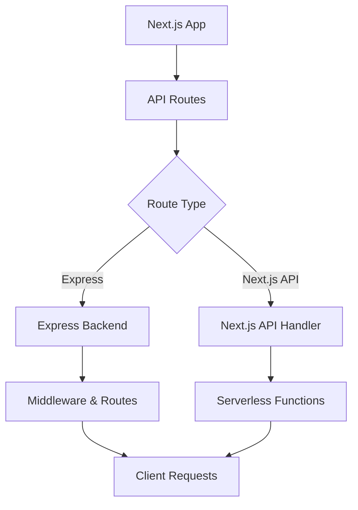

# Zero-configuration Express backends

## What changed: Zero-configuration Express backends

Vercel now supports Express backends without any setup. This means you can add an Express server to your Next.js app with zero configuration. No more custom server files or complex builds. It just works.

Why does this matter? Modern React and Next.js teams want fast APIs and easy deployment. This change lets you focus on building features, not infrastructure.

---

## Why it matters

### Impact on performance, DX, and deployment

Express is a popular Node.js framework for building APIs. Before, adding Express to Next.js required manual setup. This added complexity and risked slower builds.

With zero-config Express backends, your API routes run smoothly alongside your Next.js app. This can improve cold start times and reduce deployment errors.

### Where this fits in typical Next.js/React stacks

Most teams use Next.js for frontend and API routes. When those routes get complex, Express helps with middleware and routing.

Now, Express can run directly without extra config. This fits naturally in stacks that need custom backend logic but want to keep deployment simple.

### Who should act

- Frontend devs who want easier backend APIs.
- Developer experience (DX) owners aiming to reduce setup time.
- Performance champions looking to optimize server response.

---

## Background

### What is new?

Vercel added native support to detect and run Express apps inside your Next.js project. No need for custom servers or special build steps.

### How it compares to before

Previously, Express apps needed separate server files and manual integration. You had to manage server startup and routing yourself.

Now, Vercel handles this automatically during deployment.

### Breaking changes or migrations

If you had a custom Express server, you might need to remove it and convert your code to the new pattern. The migration is simple:

- Move Express logic into API routes or a dedicated folder.
- Remove custom server start scripts.

No major breaking changes, but test your routes carefully.

---

## Steps to get started

### Minimal starter snippet

Create an Express app inside the `api` folder:

```js
// pages/api/express.js
import express from 'express';
const app = express();

app.get('/hello', (req, res) => {
  res.json({ message: 'Hello from Express!' });
});

export default app;
```

### Enable zero-config Express

No flags or config needed. Just deploy or run locally with `vercel dev` or `next dev`.

### Key API usage example

Here is a simple Express app with middleware:

```js
// pages/api/express.js
import express from 'express';
const app = express();

// Middleware example
app.use((req, res, next) => {
  console.log('Request:', req.method, req.url);
  next();
});

app.get('/greet', (req, res) => {
  res.json({ greeting: 'Hi there!' });
});

export default app;
```

You can call `/api/express/greet` and get JSON response.

---

## Pitfalls to watch out for

### Common misconfigurations

- Forgetting to export the Express app as default.
- Mixing API route handlers with Express app exports.

### Edge cases

- SSR (Server-side rendering) routes still use Next.js handlers; Express is only for API routes.
- Edge runtimes do not support Node.js Express apps yet.
- Static export projects cannot run Express backends.

### Performance regressions

- Complex middleware chains can slow response.
- Avoid blocking synchronous code.
- Monitor cold start times if your Express app grows large.

---

## Checklist before shipping

1. **Measure before/after**: Use Web Vitals and API latency metrics.
2. **Ship a tiny demo page**: Verify Express routes work in production.
3. **Add monitoring/alerting**: Track errors and slow responses.
4. **Plan rollback path**: Keep previous API routes ready to revert.
5. **Share learnings internally**: Document setup and gotchas.

---

## Diagram idea



---

## Further reading

- [Zero-configuration Express backends - Vercel](https://vercel.com/changelog/zero-configuration-express-backends)
- [Blog - Vercel](https://vercel.com/blog)
- [Changelog - Vercel](https://vercel.com/changelog)
