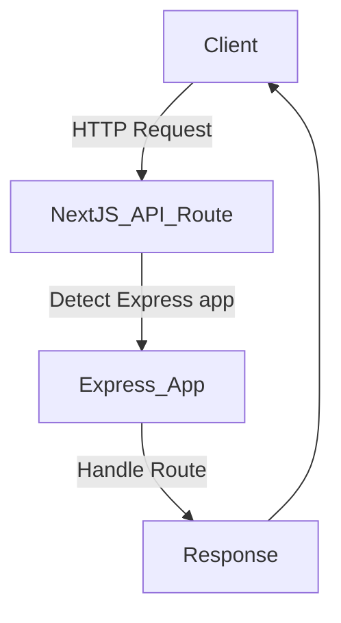

# What changed: Zero-configuration Express backends

Vercel now supports zero-configuration Express backends. This means you can run Express APIs inside your Next.js apps without extra setup. It’s a small change but it can make a big difference for React and Next.js teams.

## Why it matters

- **Performance & DX**: Express APIs spin up faster with no config. This reduces cold start times and improves developer workflow.
- **Fits Next.js stacks**: You can mix Express routes with Next.js API routes smoothly. It works well for teams moving from traditional Node.js backends.
- **Who benefits**: Frontend developers, DX owners, and performance champions should know about this. It helps ship backend features faster and with less hassle.

## Background

Previously, using Express with Next.js required manual setup: custom servers, config tweaks, and deployment adjustments. This added complexity and slowed iteration.

Now, Vercel automatically detects and runs Express apps inside your project. No config files or server rewrites needed. This is a shift toward simpler backend integration.

### Breaking changes and migration

If you had a custom Express server, you might need to remove it or adjust it. The new system expects Express code inside the API routes folder or a dedicated backend folder.

Your Express app should export the app instance directly. Middleware and routes work as usual.

## Steps to get started

### 1. Minimal example

Create a file `pages/api/express.js` with this code:

```js
import express from 'express';

const app = express();

app.get('/hello', (req, res) => {
  res.json({ message: 'Hello from Express!' });
});

export default app;
```

### 2. Enable zero-config (usually automatic)

On Vercel, no flags are needed. Just deploy and it detects Express apps.

If running locally, ensure your Next.js version supports it (Next.js 13+). Use `next dev` as usual.

### 3. Call the API

Request `/api/express/hello` and get the JSON response.

### End-to-end example

```js
// pages/api/express.js
import express from 'express';
const app = express();

app.use(express.json());

app.post('/echo', (req, res) => {
  res.json({ youSent: req.body });
});

export default app;
```

Fetch example from frontend:

```js
fetch('/api/express/echo', {
  method: 'POST',
  headers: { 'Content-Type': 'application/json' },
  body: JSON.stringify({ name: 'Alice' }),
})
  .then(res => res.json())
  .then(data => console.log(data));
```

## Pitfalls

- **Misconfigurations**: Placing Express apps outside `pages/api` or `src/pages/api` might not work. Follow Next.js conventions.
- **Edge cases**: Express is server-based and does not run on Edge functions. Mixing SSR and Edge API routes with Express needs care.
- **Performance**: Express adds some overhead compared to native Next.js API routes. Watch Web Vitals and server response times.

## Checklist before shipping

- Measure Web Vitals before and after adding Express APIs.
- Ship a small demo page that calls your Express backend.
- Add monitoring and alerting for API errors and latency.
- Plan a rollback path in case of issues.
- Share your learnings with your team.



## Summary

Zero-configuration Express backends simplify adding Express APIs to Next.js projects. They reduce setup time and improve developer experience. Use this feature when you need Express middleware or libraries that don’t fit well in native API routes.

Keep an eye on performance and deployment details. This is a helpful step for modern React/Next.js teams building full-stack apps.

---

# Further reading

- [Zero-configuration Express backends - Vercel](https://vercel.com/changelog/zero-configuration-express-backends)
- [Blog - Vercel](https://vercel.com/blog)
- [Changelog - Vercel](https://vercel.com/changelog)
