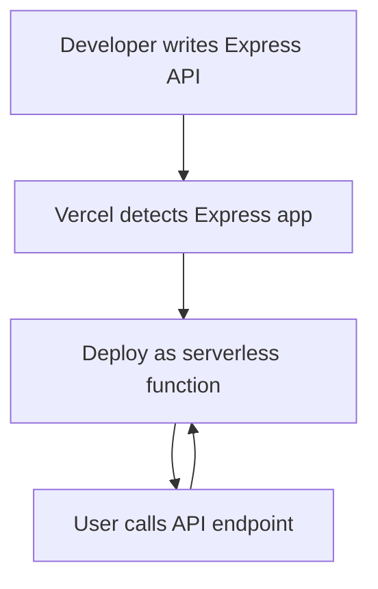

# What changed: Zero-configuration Express backends

Vercel now supports Express backends without any setup. This means you can write Express apps and deploy them on Vercel with zero configuration. It’s a simple way to add backend APIs alongside your Next.js frontend.

## Why it matters

If you build React or Next.js apps, you often need an API. Express is a popular Node.js framework for APIs. But setting up Express on serverless platforms can be tricky.

With zero-config Express backends, you get:

- Faster development. No need to tweak build or deploy settings.
- Easier deployments. Just push your Express code.
- Good performance out of the box.

This fits well in modern stacks where Next.js handles frontend and you want a quick backend without a separate server.

Frontend devs, DX owners, and performance leads should look into this. It can simplify your API layer and speed up your workflow.

## Background

Before, running Express on Vercel needed manual config. You had to customize `vercel.json` or use special adapters.

Now, Vercel detects Express apps automatically. It runs them as serverless functions without extra setup.

There are no breaking changes to existing Next.js API routes. You can add Express APIs side-by-side.

Migration is simple: just add Express code in your project and deploy.

## Steps to get started

Here’s a minimal example.

```js
// api/hello.js
const express = require('express');
const app = express();

app.get('/', (req, res) => {
  res.json({ message: 'Hello from Express!' });
});

module.exports = app;
```

Place this file inside your project under the `api` folder. Vercel will detect it as an Express backend.

No flags or config needed. Just deploy.

To call this API from your Next.js frontend:

```js
fetch('/api/hello')
  .then(res => res.json())
  .then(data => console.log(data));
```

This example shows a simple GET endpoint. You can add more routes and middleware as usual.

## Pitfalls to watch

- **Misconfigurations:** Avoid mixing Express and Next.js API routes in the same file. Keep Express apps in their own files.

- **Edge cases:** Express runs as a serverless function, not on the Edge runtime. If you need Edge APIs, use Next.js API routes or middleware.

- **Performance:** Cold starts may happen like any serverless function. Keep your Express app light to reduce latency.

- **Static exports:** If you use static HTML export, Express backends won’t run. They require serverless deployment.

## Checklist before you ship

1. **Measure before/after:** Use Web Vitals or similar to track performance impact.
2. **Ship a tiny demo:** Start with a small Express API to test.
3. **Add monitoring:** Set up error tracking and alerts for your backend.
4. **Plan rollback:** Keep your old API routes ready to revert.
5. **Share learnings:** Document your experience and share with your team.



Zero-configuration Express backends are a practical way to add APIs to your Next.js projects with minimal fuss. Try it on your next project to see how it fits your workflow.

---

# Further reading

- [Zero-configuration Express backends - Vercel](https://vercel.com/changelog/zero-configuration-express-backends)
- [Blog - Vercel](https://vercel.com/blog)
- [Changelog - Vercel](https://vercel.com/changelog)
