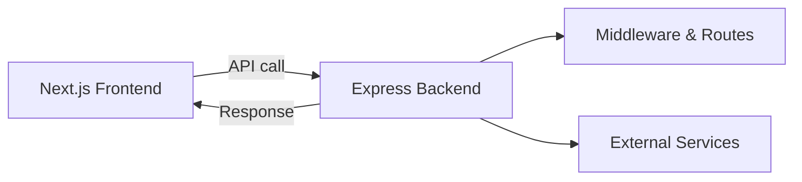

# Zero-configuration Express backends

## What changed?

Vercel now supports zero-configuration Express backends. This means you can deploy Express apps alongside your Next.js projects without extra setup. It’s automatic and works out of the box.

This matters for React and Next.js teams who want backend APIs or server logic without complex config.

## Why it matters

- **Better performance:** Express runs close to your frontend, reducing latency.
- **Improved developer experience (DX):** No more manual server config or custom builds.
- **Simpler deployment:** One platform, one deploy step.

In typical Next.js stacks, you may use API routes or serverless functions. Express backends add flexibility for middleware, routing, or legacy code.

Frontend devs, DX owners, and performance champions should explore this.

## Background

Vercel’s new feature detects Express apps automatically. Before, you had to configure custom servers or use serverless functions. This was often slow or complex.

Now, just include Express in your project. Vercel handles the rest.

There are no breaking changes if you use standard API routes. But if you migrate existing Express servers, check your middleware and routing for compatibility.

## Steps to get started

Here’s a minimal Express backend example inside a Next.js app.

```js
// /api/express.js
import express from 'express';

const app = express();

app.get('/api/express', (req, res) => {
  res.json({ message: 'Hello from Express!' });
});

export default app;
```

### How to enable

No special flags or config needed. Just deploy to Vercel.

### Key API usage

You export an Express app instance as the default export in an API route file. Vercel detects it and runs the Express server.

You can add middleware, routes, and handlers as usual.

## Pitfalls

- **Misconfiguration:** Make sure your Express app is the default export. Named exports won’t work.
- **Edge cases:** Express backends run on Node.js server environments. They don’t run on the Edge runtime or static exports.
- **Performance:** Avoid heavy synchronous code in Express handlers to keep response times low.

## Checklist before shipping

- Measure Web Vitals before and after deploying Express backend.
- Ship a small demo page that calls your Express API.
- Add monitoring and alerting for backend errors.
- Plan a rollback strategy if issues arise.
- Share your learnings with your team.

## Diagram: How zero-config Express backend fits in Next.js



## Summary

Zero-configuration Express backends simplify adding backend logic to Next.js apps. It improves DX and can boost performance. It works without extra setup. But watch for runtime limits and test carefully.

If you want more control than API routes but less hassle than custom servers, this is a good option.

---

## Further reading

- [Zero-configuration Express backends - Vercel](https://vercel.com/changelog/zero-configuration-express-backends)
- [Blog - Vercel](https://vercel.com/blog)
- [Changelog - Vercel](https://vercel.com/changelog)
