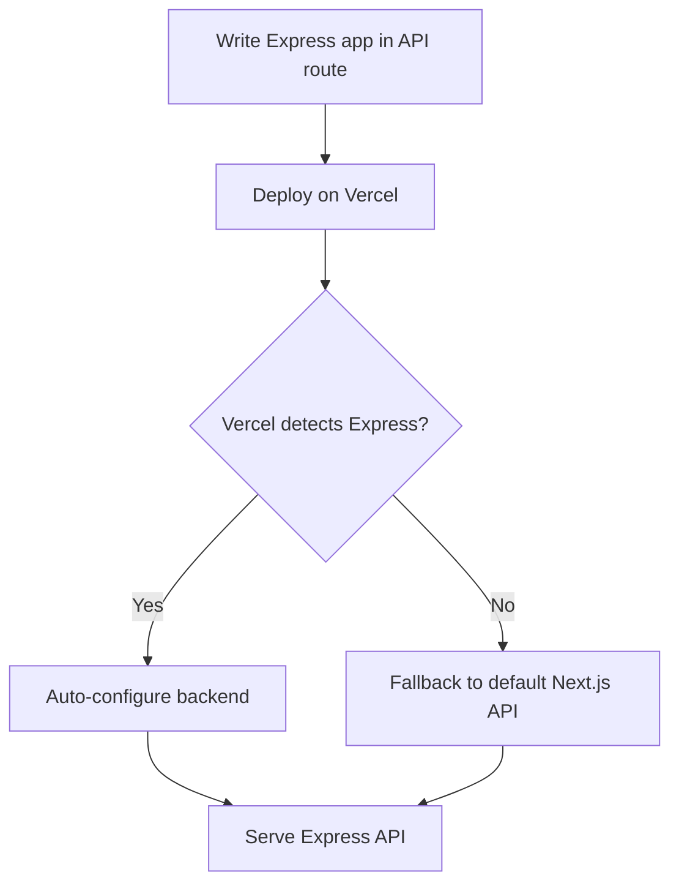

# What Changed: Zero-configuration Express Backends

Vercel now supports zero-configuration Express backends. This means you can add Express APIs to your Next.js app without extra setup. It’s faster to start and easier to maintain.

## Why It Matters

Express is a popular Node.js framework for backend APIs. Before, adding Express to Next.js required manual setup and custom server code. This added complexity and sometimes hurt performance.

With zero-configuration Express, you get:

- **Better developer experience:** No need to configure servers or routes manually.
- **Improved performance:** Optimized routing and deployment out of the box.
- **Simplified deployment:** Just deploy your app; Express APIs work automatically.

This fits naturally in modern React/Next.js stacks. Frontend devs can write backend logic without deep Node.js config. DX owners see fewer bugs and faster iteration. Performance champions get leaner server code.

## Background

### What’s new?

Vercel introduced automatic Express backend support. You write Express code in your API routes folder. Vercel detects it and handles routing and deployment without extra config.

### How it worked before

Previously, you needed a custom Express server or middleware inside Next.js. This required:

- Custom server files
- Manual route handling
- Extra build steps

### Breaking changes or migrations

If you used custom Express servers, you should:

- Remove manual server code
- Move Express logic into API routes
- Test routes as standalone endpoints

No major breaking changes otherwise. The new system is backward compatible with standard Next.js APIs.

## Steps to Get Started

### 1. Minimal example

Create a file `pages/api/hello.js` with Express code:

```js
import express from 'express';
const app = express();

app.get('/api/hello', (req, res) => {
  res.json({ message: 'Hello from Express!' });
});

export default app;
```

### 2. Enable zero-config Express

No flags needed. Just deploy to Vercel, and it auto-detects Express apps.

Locally, run your Next.js dev server as usual:

```bash
npm run dev
```

### 3. Key API usage

You can use Express middleware and routing normally:

```js
import express from 'express';
const app = express();

app.use(express.json());

app.post('/api/data', (req, res) => {
  const data = req.body;
  res.json({ received: data });
});

export default app;
```

This works end-to-end with Next.js routing and Vercel deployment.

## Pitfalls to Watch

### Common misconfigurations

- Exporting a function instead of an Express app instance.
- Mixing Next.js API handlers and Express in the same file.
- Forgetting to handle JSON parsing middleware.

### Edge cases

- SSR pages should not rely on Express APIs directly; use fetch instead.
- Edge runtimes do not support Node.js Express; this is server-only.
- Static exports can’t include Express APIs.

### Performance regressions

- Using heavy middleware can slow responses.
- Avoid blocking synchronous code inside Express handlers.

## Checklist Before Shipping

- Measure Web Vitals before and after adding Express APIs.
- Ship a small demo page calling your Express backend.
- Add monitoring and error alerting for API routes.
- Plan a rollback path if Express APIs cause issues.
- Share your learnings with your team to improve DX.



## Summary

Zero-configuration Express backends simplify adding APIs to Next.js apps. They reduce setup time and improve performance. Frontend teams can build full-stack apps with less friction. Just write Express code in API routes and deploy. Watch out for middleware and runtime limits. Measure impact and share results.

# Further reading

- [Zero-configuration Express backends - Vercel](https://vercel.com/changelog/zero-configuration-express-backends)
- [Blog - Vercel](https://vercel.com/blog)
- [Changelog - Vercel](https://vercel.com/changelog)
