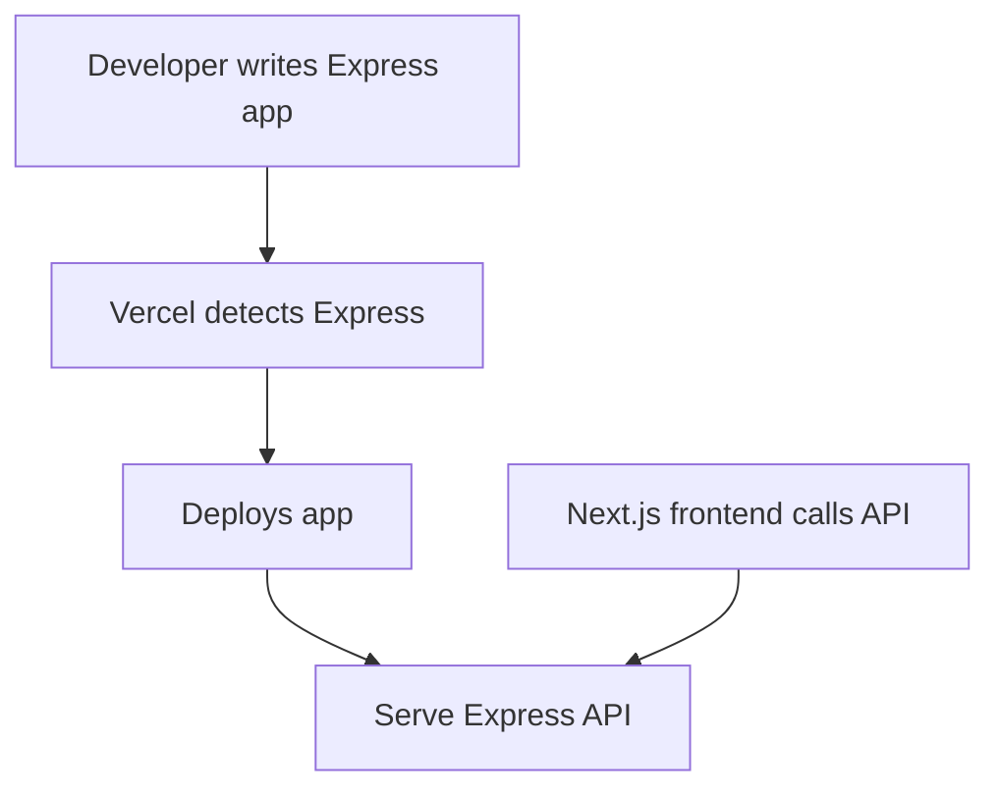

# Zero-configuration Express backends

## What changed

Vercel now supports zero-configuration Express backends. This means you can deploy Express apps alongside your Next.js projects without extra setup. It’s faster to start and easier to maintain.

## Why it matters

This update impacts three key areas:

- **Performance:** Express runs natively on Vercel’s platform with optimized routing.
- **Developer Experience (DX):** No need for custom server setups or complex config files.
- **Deployment:** Deploy your backend with your frontend in one step.

For React and Next.js teams, this fits naturally. You can keep your API routes in Next.js and add Express for complex backend logic. Frontend devs, DX owners, and performance champions should consider using this.

## Background

### What is new?

Vercel now auto-detects Express apps in your repo. It runs them directly without manual config or custom server files.

### How was it before?

Previously, to run Express with Next.js, you needed custom server code and extra config. This added complexity and slowed deployments.

### Breaking changes or migration?

If you have a custom Express server, you can simplify your setup by removing manual configs. However, if you rely on specific server hooks or middleware, test carefully before migrating.

## Steps to get started

### 1. Minimal example

Create a simple Express app in `api/index.js`:

```js
const express = require('express');
const app = express();

app.get('/hello', (req, res) => {
  res.json({ message: 'Hello from Express!' });
});

module.exports = app;
```

### 2. Enable zero-config

No flags or special config needed. Just deploy to Vercel. The platform detects Express and runs it automatically.

### 3. End-to-end use

Call your Express route from React:

```jsx
import { useEffect, useState } from 'react';

export default function Hello() {
  const [msg, setMsg] = useState('Loading...');

  useEffect(() => {
    fetch('/api/hello')
      .then(res => res.json())
      .then(data => setMsg(data.message));
  }, []);

  return <div>{msg}</div>;
}
```

## Common pitfalls

- **Misconfiguration:** Make sure your Express app exports the app object directly. Do not start the server with `app.listen()`.

- **Edge cases:** Express runs on Node.js serverless functions. It doesn’t run on the Edge runtime. Avoid using Edge-only features inside Express.

- **Performance:** Watch out for cold starts if your Express app is large. Keep routes minimal and dependencies light.

## Checklist before and after deployment

- Measure Web Vitals before and after adding Express backend.
- Ship a small demo page that calls your Express API.
- Add monitoring and alerting for API errors and latency.
- Plan a rollback path if Express backend causes issues.
- Share your experience and learnings with your team.



## Summary

Zero-configuration Express backends let you add backend logic easily to your Next.js apps. It improves DX and deployment speed. Watch for edge cases and measure impact. This feature is a good fit for teams needing simple backend APIs alongside React frontends.

---

## Further reading

- [Zero-configuration Express backends - Vercel](https://vercel.com/changelog/zero-configuration-express-backends)
- [Blog - Vercel](https://vercel.com/blog)
- [Changelog - Vercel](https://vercel.com/changelog)
