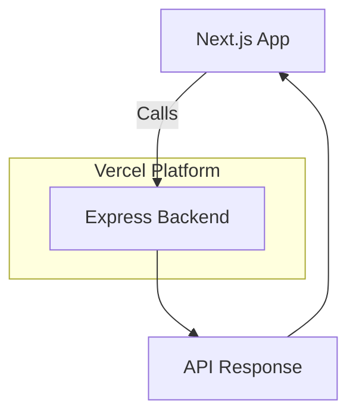

# What changed: Zero-configuration Express backends

Vercel now supports zero-configuration Express backends. This means you can add Express APIs to your Next.js apps without extra setup. It’s faster to start and easier to maintain. This change matters for React and Next.js teams aiming for better developer experience and performance.

---

# Why it matters

## Impact on performance, DX, and deployment

Express is popular for backend APIs. But setting it up in Next.js often means extra config and build steps. Zero-config removes that friction. You get faster builds and quicker deployments. It also means less code and fewer mistakes.

## Where this fits in Next.js/React stacks

Most Next.js apps use API routes or serverless functions. Express brings more backend power, like middleware and routing. With zero-config support, Express can run alongside your Next.js app seamlessly.

## Who should act

- Frontend engineers who want backend APIs without complex setup.
- DX owners looking to simplify developer workflows.
- Performance champions who want faster builds and better runtime behavior.

---

# Background

## What’s new?

Vercel now automatically detects Express backend code in your project. It builds and deploys it without extra config. No need to eject or customize build scripts.

## Previous approach

Before, you had to manually configure Express servers. This meant custom server files, build tweaks, or separate deployments. It slowed teams down and added maintenance overhead.

## Breaking changes or migrations

If you have a custom Express setup, you might want to migrate to the zero-config approach. It’s mostly additive, but check your build scripts. Remove manual Express server configs to avoid conflicts.

---

# Steps to get started

## 1. Minimal example

Create a simple Express app inside your Next.js project:

```js
// api/express-server.js
import express from 'express';

const app = express();

app.get('/api/hello', (req, res) => {
  res.json({ message: 'Hello from Express!' });
});

export default app;
```

## 2. Enable zero-config (usually automatic)

Vercel auto-detects Express apps in your project. No flags or special config needed. Just deploy your Next.js app.

If you want to customize, check your `vercel.json` for overrides, but defaults work well.

## 3. Use Express API in your app

Fetch data from your Express route:

```js
// pages/index.js
import { useEffect, useState } from 'react';

export default function Home() {
  const [msg, setMsg] = useState('');

  useEffect(() => {
    fetch('/api/hello')
      .then(res => res.json())
      .then(data => setMsg(data.message));
  }, []);

  return <h1>{msg}</h1>;
}
```

This example shows an end-to-end Express backend with a React frontend in Next.js.

---

# Pitfalls to watch

## Common misconfigurations

- Exporting Express app incorrectly. Use `export default app;`.
- Mixing Express with Next.js API routes on the same path can cause conflicts.

## Edge cases

- SSR (Server-Side Rendering): Express APIs run separately from SSR code. Avoid calling Express routes directly from SSR.
- Edge functions or static export: Express backends require Node.js runtime. They won’t work in purely static builds or Edge environments.

## Performance regressions

- If your Express code is heavy or blocks the event loop, it can slow down API responses.
- Monitor cold start times if deployed as serverless functions.

---

# Checklist before shipping

1. **Measure before/after**: Use Web Vitals to check performance impact.
2. **Ship a tiny demo page**: Validate Express backend works in production.
3. **Add monitoring/alerting**: Track API errors and latency.
4. **Plan rollback path**: Keep previous setup handy in case of issues.
5. **Share learnings internally**: Document benefits and gotchas for your team.

---

# Diagram idea



---

# Further reading

- [Zero-configuration Express backends - Vercel](https://vercel.com/changelog/zero-configuration-express-backends)
- [Blog - Vercel](https://vercel.com/blog)
- [Changelog - Vercel](https://vercel.com/changelog)
