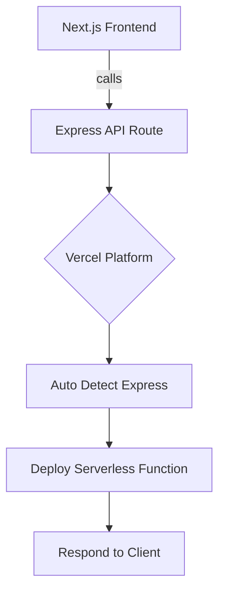

# What Changed: Zero-configuration Express backends

Vercel now supports zero-configuration Express backends. This means you can add Express APIs to your Next.js apps without extra setup. It’s faster to build and deploy. Let’s see why this matters.

---

# Why It Matters

Express is a popular Node.js framework. Many React and Next.js teams use it for backend APIs.

Before, adding Express required manual setup and config. That added complexity and slowed down development.

Now, zero-config means:

- **Better performance:** Vercel optimizes Express APIs automatically.
- **Improved developer experience (DX):** No boilerplate or custom server code.
- **Simpler deployments:** Just push your code, and it works.

This fits well in modern Next.js stacks. You can keep React for frontend and add Express APIs seamlessly.

Who benefits?

- Frontend engineers who want quick backend APIs.
- DX owners aiming to reduce config overhead.
- Performance champions looking for optimized server code.

---

# Background

Previously, to use Express with Next.js, you had to create a custom server. This meant extra code and more maintenance.

You also had to configure routing and deployment settings manually.

With zero-configuration Express backends, Vercel detects Express apps automatically. It handles routing and deployment for you.

There are no breaking changes if you switch. But you should remove old custom server code.

Migration is straightforward:

- Delete custom server files.
- Move Express code to API routes or dedicated folders.
- Deploy as usual.

---

# Steps to Get Started

Here’s a minimal example.

```js
// api/hello.js
const express = require('express');
const app = express();

app.get('/api/hello', (req, res) => {
  res.json({ message: 'Hello from Express!' });
});

module.exports = app;
```

No extra config needed. Just place this file in your project.

To enable zero-config Express backends on Vercel, ensure your project uses the latest Vercel platform version. Usually, this is automatic.

Key API usage:

- Export your Express app from an API route file.
- Use standard Express middleware and routing.

End-to-end example:

1. Create an `api/hello.js` file as above.
2. Run your Next.js app locally with `next dev`.
3. Visit `http://localhost:3000/api/hello`.
4. Deploy to Vercel.
5. The endpoint works without extra setup.

---

# Pitfalls to Watch

- **Misconfigurations:** Ensure your Express app is exported correctly. Export the app instance, not a handler function.

- **Edge cases:** Some Next.js features like Static Site Generation (SSG) or Edge Runtime do not support Express APIs. Use Express only in serverless API routes.

- **Performance regressions:** Avoid heavy middleware or blocking code in Express routes. Although Vercel optimizes deployment, slow code still affects response time.

- **Routing conflicts:** Don’t mix Next.js API routes and Express routes with overlapping paths.

- **Middleware compatibility:** Some Express middleware may not work in serverless environments.

---

# Checklist Before You Ship

1. **Measure before and after:** Use Web Vitals or other metrics to see performance impact.
2. **Ship a tiny demo page:** Test your Express endpoint with a simple React page.
3. **Add monitoring and alerting:** Track API errors and latency.
4. **Plan rollback path:** Keep old custom server code ready in case you need to revert.
5. **Share learnings internally:** Document your migration and tips for your team.

---

# Diagram: Zero-configuration Express backend flow



---

# Further reading

- [Zero-configuration Express backends - Vercel](https://vercel.com/changelog/zero-configuration-express-backends)
- [Blog - Vercel](https://vercel.com/blog)
- [Changelog - Vercel](https://vercel.com/changelog)
