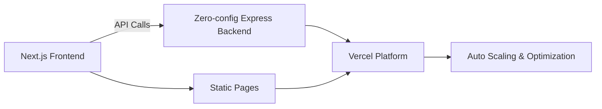

# What changed: Zero-configuration Express backends

Vercel now supports zero-configuration Express backends. This means you can deploy Express apps without extra setup. For React and Next.js teams, this change can speed up backend development and improve deployment flow.

# Why it matters

Express is a popular Node.js framework for backend APIs. Many Next.js apps use API routes or separate Express servers. Previously, running Express on Vercel required manual config. Now, it works out of the box.

This matters because:

- **Performance:** Vercel optimizes Express apps automatically.
- **Developer Experience (DX):** No config means less setup and fewer errors.
- **Deployment:** Faster and simpler backend deployments alongside your frontend.

Teams building fullstack React/Next.js apps can move faster. Frontend devs can own backend APIs more easily. Performance champions get better runtime optimizations by default.

# Background

Vercel’s new feature detects Express apps automatically. You just deploy your Express code. No need for custom serverless functions or special build steps.

Before, you had to wrap Express inside serverless handlers or configure output directories. This added complexity and sometimes hurt cold starts.

Now, Vercel runs Express apps as standalone backends with smart defaults. This reduces boilerplate and makes scaling easier.

**Breaking changes:** If you had custom Express setups with manual configs, you might want to remove them. The zero-config approach assumes standard Express apps. Custom middleware or unusual setups may need testing.

# Steps to get started

Here’s a minimal Express app you can deploy on Vercel with zero config:

```js
// api/index.js
const express = require('express');
const app = express();

app.get('/api/hello', (req, res) => {
  res.json({ message: 'Hello from Express!' });
});

module.exports = app;
```

Just place this in your project and deploy to Vercel. No extra config needed.

If you want to enable zero-config explicitly, add this to your `vercel.json`:

```json
{
  "features": {
    "zeroConfigExpress": true
  }
}
```

But usually, Vercel detects Express automatically.

**Key API usage:** Your Express app exports the `app` instance. Vercel handles the server lifecycle. You write standard Express routes.

Example end-to-end:

- Write Express API in `api/*.js`.
- Deploy to Vercel.
- Access endpoints like `/api/hello`.

# Pitfalls to watch out for

- **Misconfigurations:** Using both custom serverless wrappers and zero-config can conflict.
- **Edge cases:** Express apps running with SSR or Edge functions may behave differently.
- **Static sites:** If you mix static exports with Express backends, routing might need care.
- **Performance:** Heavy middleware or blocking code can still slow down responses.

Test your app under load and check cold start times.

# Checklist before shipping

- Measure Web Vitals before and after switching to zero-config Express.
- Ship a small demo page that calls your Express API.
- Add monitoring and alerting to catch errors or slow responses.
- Plan a rollback path in case issues arise.
- Share your learnings with your team for smooth adoption.

# Diagram: How zero-config Express fits in Next.js stack



# Further reading

- [Zero-configuration Express backends - Vercel](https://vercel.com/changelog/zero-configuration-express-backends)
- [Blog - Vercel](https://vercel.com/blog)
- [Changelog - Vercel](https://vercel.com/changelog)
