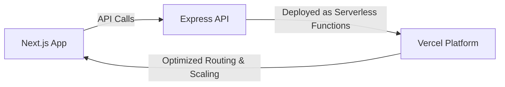

# Zero-configuration Express backends

## What changed?

Vercel now supports zero-configuration Express backends. This means you can add Express servers to your Next.js apps without extra setup. No manual config, no complex deployment steps. Just write your Express code and deploy.

This is a big deal for React and Next.js teams who want backend logic alongside their frontend with minimal hassle.

## Why it matters

### Impact on performance, DX, and deployment

Express is a popular Node.js server framework. Previously, adding Express to Next.js required custom server setups. This added complexity and slowed deployment.

With zero-config support, Express runs optimized on Vercel's platform. It improves cold start times and reduces overhead. Developers get faster feedback loops and simpler deployments.

### Where it fits in Next.js/React stacks

Next.js already supports API routes and middleware. Express backends let you move more backend logic into familiar Express patterns. This is useful for teams migrating legacy APIs or needing flexible routing.

You can mix Express APIs with Next.js pages seamlessly.

### Who should act?

- Frontend engineers who want backend control without setup pain.
- Developer experience owners aiming to simplify full-stack development.
- Performance champions looking to reduce server latency and cold starts.

## Background

### What is new?

Vercel now auto-detects Express servers in your project. It configures builds and deployments automatically. No need for custom server.js files or manual routing config.

### How it compares to before

Before, you had to eject from Next.js defaults and manage Express yourself. This meant more boilerplate and potential deployment errors.

Now, Express apps work out-of-the-box on Vercel alongside Next.js.

### Breaking changes or migrations

If you used custom Express setups before, review your server code. The new system expects Express apps in standard locations (like `/api` folder) and might handle routing differently.

Migration usually means moving your Express code into the designated API folder and removing manual server scripts.

## Steps to get started

### Minimal example

Create an Express API in `pages/api/hello.js`:

```js
import express from 'express';

const app = express();

app.get('/api/hello', (req, res) => {
  res.json({ message: 'Hello from Express!' });
});

export default app;
```

### Enable zero-config

No flags needed. Just deploy to Vercel. It detects Express and configures automatically.

### Key API usage

You can use all Express features: routing, middleware, error handling.

Example with middleware:

```js
import express from 'express';

const app = express();

// Simple logger middleware
app.use((req, res, next) => {
  console.log(`${req.method} ${req.url}`);
  next();
});

app.get('/api/time', (req, res) => {
  res.json({ time: new Date().toISOString() });
});

export default app;
```

This runs as a serverless function behind the scenes.

## Pitfalls

### Common misconfigurations

- Placing Express code outside the API folder can break detection.
- Exporting Express apps incorrectly (must export the Express app instance as default).

### Edge cases

- SSR pages and Express APIs run separately. Avoid trying to mix SSR logic inside Express handlers.
- Edge runtime (like Vercel Edge Functions) does not support Express. Use API routes or middleware for edge.
- Static pages don’t interact with Express APIs directly.

### Performance regressions

- Avoid heavy synchronous code in Express handlers; it blocks the event loop.
- Watch for cold starts if your Express APIs have large dependencies.

## Checklist before shipping

- Measure Web Vitals before and after adding Express.
- Deploy a small demo page calling your Express API.
- Add monitoring and alerting on API errors and latency.
- Plan a rollback path if Express APIs cause issues.
- Share your findings and setup tips with your team.

## Diagram idea



## Further reading

- [Zero-configuration Express backends - Vercel](https://vercel.com/changelog/zero-configuration-express-backends)
- [Blog - Vercel](https://vercel.com/blog)
- [Changelog - Vercel](https://vercel.com/changelog)
