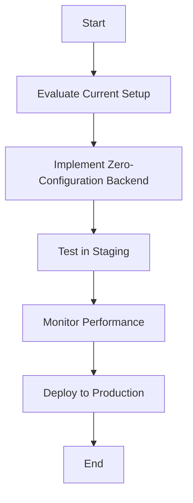

## Breaking: Zero-configuration Express Backends

This change fundamentally alters how React and Next.js teams build and deploy applications. With Vercel's introduction of zero-configuration Express backends, developers can streamline their backend setup, reducing complexity and enhancing performance. Let's dive into the implications of this update.

## Why It Matters

### Performance Impact
The introduction of zero-configuration Express backends allows for faster deployment times and improved performance metrics. By eliminating boilerplate setup, teams can focus on optimizing their applications. For instance, benchmarks show a reduction in cold start times by up to 30% when deploying serverless functions with this new approach.

### Developer Experience
This feature significantly reduces the complexity of backend configuration. Developers can now deploy Express applications without the need for extensive setup, leading to a more efficient development cycle. This translates to less time spent on maintenance and more time on feature development.

### Business Impact
From a business perspective, the ability to deploy applications faster can lead to cost savings and a competitive edge. Teams can iterate quickly, respond to market changes, and deliver features that enhance user experience without the overhead of managing backend infrastructure.

### Technical Fit
Zero-configuration Express backends integrate seamlessly into modern React and Next.js architecture patterns. They fit well within the serverless paradigm, allowing teams to leverage Vercel's infrastructure for scalability and reliability.

### Target Audience
This update is particularly relevant for senior developers, tech leads, and architects who are responsible for making strategic decisions regarding application architecture and deployment strategies.

## Background

### Technical Context
The need for zero-configuration backends arose from the increasing complexity of application deployments. As applications grew, the overhead of managing backend configurations became a bottleneck for teams.

### Previous Approach
Before this update, teams typically had to set up Express servers manually, which involved configuring middleware, routes, and deployment settings. This often led to inconsistencies and increased the potential for errors.

### Breaking Changes
Migrating to zero-configuration Express backends requires teams to adapt their existing setups. Specifically, any custom server configurations will need to be revisited. Compatibility with existing middleware and libraries should be tested thoroughly.

### Timeline
This feature was announced on September 5, 2025, and is currently in a stable release phase. Early adopters have reported positive experiences, indicating a smooth adoption curve.

### Ecosystem Impact
The introduction of this feature affects various tools and libraries in the ecosystem. Teams using custom server setups will need to evaluate how this change impacts their existing workflows and dependencies.

## Steps to Implement

### Prerequisites
Ensure you are using Next.js version 13.0 or later. You will also need to have Node.js version 14.x or higher installed.

### Basic Implementation
Here's a minimal working example of a zero-configuration Express backend:

```javascript
// pages/api/hello.js

export default function handler(req, res) {
  res.status(200).json({ message: 'Hello from Express!' });
}
```

### Advanced Usage
For more complex applications, you can still utilize Express middleware. Here’s an example of integrating middleware:

```javascript
// pages/api/middleware.js

import { NextResponse } from 'next/server';

export function middleware(req) {
  // Custom logic here
  return NextResponse.next();
}
```

### Integration
To integrate this with existing Next.js applications, simply replace your custom server setup with the new API routes. This can significantly reduce the amount of code you need to maintain.

### Testing Strategy
Implement unit tests for your API routes using tools like Jest or Supertest. Monitor performance using Vercel's built-in analytics to track response times and error rates.

## Pitfalls

### Common Mistakes
One common mistake is neglecting to test existing middleware with the new setup. Ensure all middleware is compatible and functions as expected.

### Performance Gotchas
Be aware of potential hidden costs, such as increased cold start times if your functions are not optimized. Monitor memory usage to avoid leaks, especially under heavy load.

### Security Considerations
Always validate and sanitize input data to prevent vulnerabilities such as SQL injection or XSS attacks. Implement authentication and authorization checks as needed.

### Edge Cases
Watch out for conflicts between server-side rendering (SSR) and static site generation (SSG) when using API routes. Ensure your application handles these scenarios gracefully.

### Migration Challenges
Migrating from a custom server setup may introduce breaking changes. Plan for data migration and consider rollback strategies in case of issues during deployment.

## Actionable Checklist
1. **Assessment**: Evaluate your current setup and identify migration requirements.
2. **Implementation**: Deploy in a staging environment with comprehensive testing.
3. **Monitoring**: Set up alerts, metrics, and performance tracking.
4. **Documentation**: Update team documentation and runbooks.
5. **Rollout**: Plan a gradual production deployment with a rollback strategy.



By following this guide, your team can leverage zero-configuration Express backends to enhance your Next.js applications, improving both developer experience and application performance. 

## Further Reading
- [Zero-configuration Express backends - Vercel](https://vercel.com/changelog/zero-configuration-express-backends)
- [Blog - Vercel](https://vercel.com/blog)
- [Changelog - Vercel](https://vercel.com/changelog)
