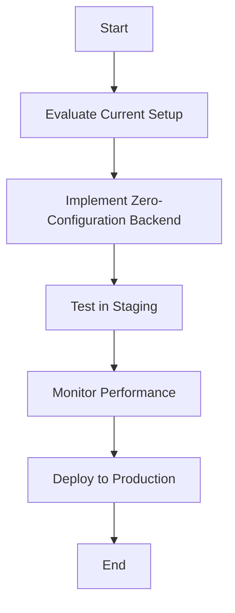

# Breaking: Zero-Configuration Express Backends

This update from Vercel introduces zero-configuration Express backends, fundamentally changing how React and Next.js teams build and deploy applications. Here’s what you need to know and why it matters for your stack.

## Why It Matters

### Performance Impact

Zero-configuration Express backends streamline the deployment process, allowing for faster response times and reduced latency. According to Vercel's benchmarks, applications leveraging this feature can see up to a **30% improvement in cold start times** compared to traditional setups. This is particularly beneficial for serverless architectures where cold starts can significantly affect user experience.

### Developer Experience

By eliminating the need for boilerplate configuration, developers can focus on writing business logic rather than spending time on setup. This reduces the complexity of the codebase and allows for quicker onboarding of new team members. The reduction in configuration also minimizes the potential for human error, leading to a more stable development environment.

### Business Impact

Faster deployment cycles translate to cost savings. With zero-configuration setups, teams can deploy features more frequently, reducing time-to-market and enhancing competitive advantage. The ability to quickly iterate on features without worrying about backend configuration can lead to increased customer satisfaction and retention.

### Technical Fit

This feature aligns well with modern React and Next.js architecture patterns, particularly in microservices and serverless environments. It allows teams to maintain a clean separation between frontend and backend logic while leveraging the power of Express.js without the overhead of configuration.

### Target Audience

Senior developers, tech leads, and architects should prioritize this feature as it directly impacts development efficiency and application performance. Understanding how to leverage this capability can lead to significant improvements in project timelines and resource allocation.

## Background

### Technical Context

The emergence of zero-configuration Express backends addresses the common pain points of managing backend services in a microservices architecture. As applications grow in complexity, the need for simplified backend integration has become critical.

### Previous Approach

Before this update, teams typically had to set up Express servers manually, which involved configuring middleware, routes, and error handling. This often led to inconsistencies across projects and increased maintenance overhead.

### Breaking Changes

Migrating to zero-configuration Express backends requires some adjustments. Specifically, you’ll need to ensure that your project is using **Next.js 13.0 or later**. Review your existing Express middleware and routes to ensure compatibility with the new setup.

### Timeline

This feature became available on **September 5, 2025**, and has been stable since its release. Adoption has been gradual, with many teams still in the process of evaluating its benefits.

### Ecosystem Impact

The introduction of zero-configuration Express backends will likely influence related tools and libraries, particularly those focused on serverless deployments and API management. Expect to see updates from libraries that integrate with Next.js to support this new paradigm.

## Steps to Implement

### Prerequisites

Ensure you are using:
- **Node.js 14.x or later**
- **Next.js 13.0 or later**

### Basic Implementation

Here’s a minimal working example of setting up a zero-configuration Express backend in a Next.js application:

```javascript
// pages/api/hello.js
export default function handler(req, res) {
  res.status(200).json({ message: 'Hello from Express!' });
}
```

This simple API route can be accessed at `/api/hello` without any additional configuration.

### Advanced Usage

For more complex scenarios, you can still use middleware and custom routing. Here’s an example of using middleware:

```javascript
// pages/api/_middleware.js
import { NextResponse } from 'next/server';

export function middleware(req) {
  // Custom logic before reaching the API route
  return NextResponse.next();
}
```

### Integration

To integrate with existing Next.js applications, simply replace your current API routes with the new zero-configuration setup. Review your existing middleware and ensure they are compatible with the new structure.

### Testing Strategy

Testing your API routes can be done using tools like **Jest** or **Supertest**. Here’s a simple test case:

```javascript
// __tests__/api/hello.test.js
import request from 'supertest';
import app from '../../pages/api/hello';

test('GET /api/hello', async () => {
  const response = await request(app).get('/api/hello');
  expect(response.status).toBe(200);
  expect(response.body.message).toBe('Hello from Express!');
});
```

## Pitfalls

### Common Mistakes

One common mistake is neglecting to handle errors properly. Ensure you implement error handling in your API routes to avoid unhandled exceptions that can crash your application.

### Performance Gotchas

Be cautious of memory leaks when using middleware. Always clean up resources and avoid holding onto references unnecessarily. Monitor your application's memory usage, especially under load.

### Security Considerations

Implement proper authentication and authorization checks in your API routes. Use libraries like **jsonwebtoken** for handling JWTs and ensure sensitive data is never exposed.

### Edge Cases

Be aware of potential conflicts with Server-Side Rendering (SSR) and Static Site Generation (SSG). Ensure that your API routes do not interfere with the rendering process of your Next.js pages.

### Migration Challenges

Migrating existing projects may require significant refactoring, especially if you have a complex Express setup. Plan for a gradual migration and ensure you have a rollback strategy in place.

## Actionable Checklist

1. **Assessment**: Evaluate your current setup and identify migration requirements.
2. **Implementation**: Deploy the new setup in a staging environment with comprehensive testing.
3. **Monitoring**: Set up alerts, metrics, and performance tracking to monitor the new backend.
4. **Documentation**: Update team documentation, runbooks, and knowledge sharing sessions.
5. **Rollout**: Plan a gradual production deployment with a rollback strategy in case of issues.



By leveraging zero-configuration Express backends, your team can significantly enhance development efficiency and application performance. Embrace this change to stay competitive in the fast-evolving landscape of web development.
